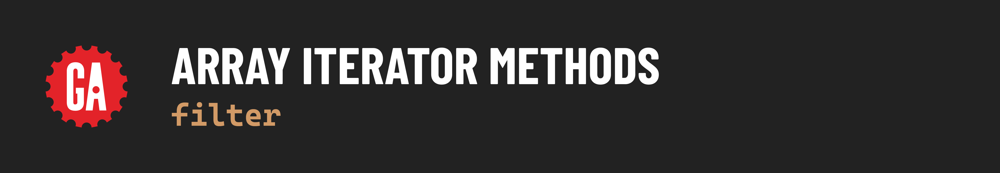

# 

**Learning objective:** By the end of this lesson, students will be able to use `filter()` to filter down an array to elements that pass a given test.

PURPOSE: Select certain elements from a source array.

`filter()` selects certain elements from a source array, returning a new array with only those elements. 

Its callback function requires a conditional statement that will either resolve to truthy or falsy when returned, and `filter()` uses that value to decide if it should “keep” the element or not. If falsy, the element does not get added to the new array and is “discarded.“ The new array will thus have only “true” elements, based on the criteria provided. 

One easy way to see this is by using literal `true` or `false` Boolean values: 

```javascript
const arr = [true, false, true, false, false, true]

const filteredArr = arr.filter((element) => {
  return element;
});

console.log(filteredArr); // [true, true, true]
```

This also works with truthy values: 

```javascript
const arr = [true, false, 0, 'string', '', null, undefined, 42]

const filteredArr = arr.filter((element) => {
  return element;
});

console.log(filteredArr); // [true, 'string', 42]
```


Typically, `filter()` will make use of some sort of comparison or equality operator: 

### Obtain all numbers over 50

```javascript
const nums = [100, 2, 5, 42, 99]

const numsOver50 = nums.filter((num) => {
  return num > 50;
});

console.log(numsOver50); // [100, 99]
```

### Obtain just the odd numbers

```javascript
const nums = [100, 2, 5, 42, 99]

const odds = nums.filter((num) => {
  return num % 2;
});

console.log(odds);
```


### You Do 💪

Filter out all “jerks” and make a “jerk-free“ array named `notJerks`.

```javascript
const people = ['jerks', 'nice people', 'jerks', 'nice people', 'nice people'];
```